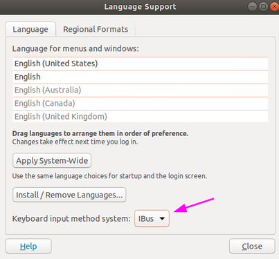
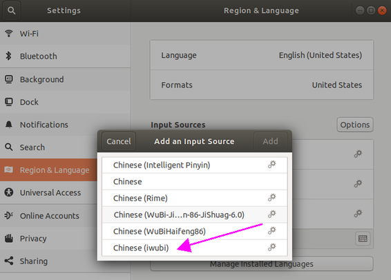

# iWubi
**iWubi** A new **Wubi** input method based on **IBus**. Features like Microsoft Wubi input method.


# Features & TODO
- [x] Shift_L toggle Chinese/English input mode. 
- [x] Wubi Pinyin mixed input.
- [x] Show Wubi coding of Pinyin candidate.
- [x] Chinese punctuation in Chinese mode, English punctuation in English mode.
- [ ] `Z` key fuzzy search.
- [ ] Cloud update Pinyin database.
- [ ] Gnome input method indicator when switch English/Chinese.
- [ ] deb packaging.

# Dependencies
- IBus 1.5
- Python 3.6
- python3-gi

Tested on Ubuntu 18.04

# Install
0. Install dependencies
```
sudo apt install ibus python3.6 python3-gi 
```
1. Set IBus as System Keyboard input method


2. make install
```
sudo make install
```
3. IBus restart
```
ibus restart
```
If use Anaconda, `conda deactivate` first to let `ibus restart` use the System's Python, cause ibus need System's `gi`.
 ```
conda deactivate
ibus restart
 ```
4. Add an input source from Setting.

 

# Uninstall
```
sudo make uninstall
```

# Debug
Develop and Debug.
```
tail -f /tmp/iwubi.log
```


# Great Open source based on
- [IBus](https://github.com/ibus/ibus) iWubi based on IBus input method framework.
- [ibus-table](https://github.com/kaio/ibus-table)  Fork some functions implementation.
- [ibus-table-wubi](https://github.com/ibus/ibus/wiki) Fork wubi database `wubi-jidian86.db`.
- [rime-pinyin-simp](https://github.com/rime/rime-pinyin-simp) Fork pinyin database `pinyin_simp.dict.yaml`. 